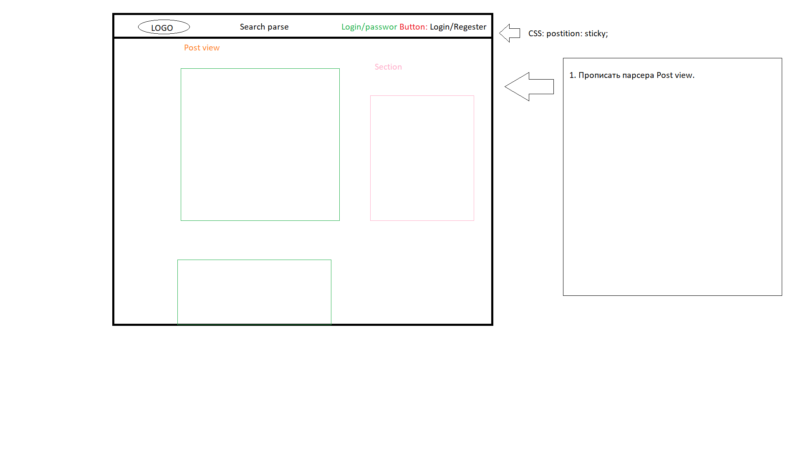
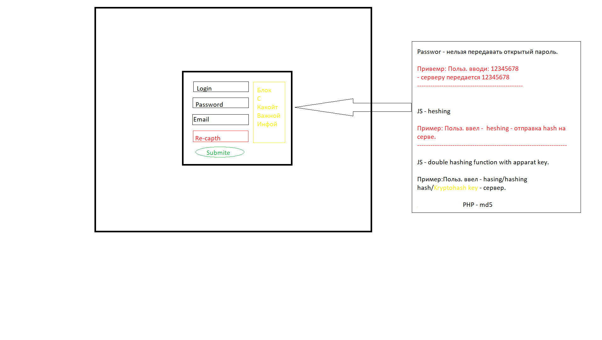
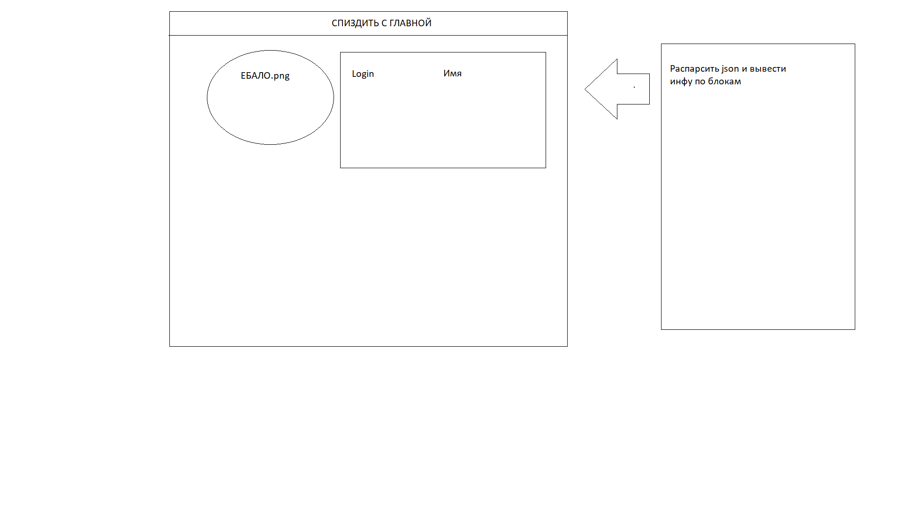

# Project-R ver. 0.1


# Техническое задание Front


1. Оформить главную страницу. 
     * Придумать дизайн 
     * Сверстать 
     * Сделать шапку с кнопками регистрации или входа
2. Создать форму регистрации и входа
     * Вход будет осуществляться посредсвом API (Прим. 1)
       * Передаем логин, хэшированный пароль. От сервера получаем положительный или отрицательный ответ и hash login token  
     * На форме регистрации от пользователя требуется: ФИО, EMAIL, телефон, пароль и логин.
       * Отправка пароля работает по форме ***Double hashing*** (Хэшируем, прогоняем хэш через хэщирование и отправляем)
     * На форме авторизации Логин и пароль.
     * Все должно быть сереализовано, для пущей безопасности. Нужно придумать сереализатор
       * Cookie serialize

```JavaScript
Пример 1:

// 1. Создаём новый объект XMLHttpRequest
var xhr = new XMLHttpRequest();

// 2. Конфигурируем его: GET-запрос на URL 'phones.json'
xhr.open('GET', 'phones.json', false);

// 3. Отсылаем запрос
xhr.send();

// 4. Если код ответа сервера не 200, то это ошибка
if (xhr.status != 200) {
  // обработать ошибку
  alert( xhr.status + ': ' + xhr.statusText ); // пример вывода: 404: Not Found
} else {
  // вывести результат
  alert( xhr.responseText ); // responseText -- текст ответа.
}
```

3. Создать страницу личного кабинета.
     * Пока оставим пустым.
     * Но можно добавить редактирование информации (допустим тупо загрузить аватарку) 


### Макет главной страницы


### Регистрация 


### Личный кабинет


# Техническое задание Back
1. Создание БД. 
     * Создать таблицу Users
       * Таблица должна содержать поля: Имя, фамилия, отчество, телефон, электронная почта, логин, пароль.
2. Создать `API` и реализовать `CRUD`
     * Создание пользователя
     * Получение пользователя
     * Добавление пользователя
     * Удаление пользователя

# Техническая документация Back-end SLIM API
## Готовые запросы 
> ***localhost***/api/getUsers - Возвращает JSON с данными всех пользователей.

## Обработчики
* getUsers


```PHP ////Получаем данные всех пользователей
$app->get('/api/getUsers',function($request,$response,$args) {
  //Подключаемся к БД. Передаем название таблички.
  $DB = createCon('Project_B');////// DB_CONNECTION
  if ($DB == false){
    $response->write("Ошибка: Невозможно подключиться к MySQL " . mysqli_connect_error());
  }
  else {
    $response->write("Соединение установлено успешно");
    $result = getAllUsers($DB);////// DB_CONNECTION
    $rows = mysqli_fetch_all($result, MYSQLI_ASSOC);
    return $response->withJson($rows);
}
});
```
**JSON**
``` JSON
{"idUser":"1",
"Name":"Vladislav",
"secondName":"Novikov",
"phoneNumber":"563666",
"email":"vladonnx@mail.ru",
"login":"Highjin",
"password":"12345678"}
```


* addUser


```PHP ////Добавление юзера
$app->get('/api/addUser',function($request,$response,$args) {
  //Подключаемся к БД. Передаем название таблички.
  $DB = createCon('hellohexx_test');////// DB_CONNECTION
  $getLog = $request->getQueryParams()['log'];//Получение параметров из POST.
  $getPassword = $request->getQueryParams()['pas'];//
  //////Проверка  подключения
  if ($DB == false){
    $response->write("Ошибка: Невозможно подключиться к MySQL " . mysqli_connect_error());
  }
  else {
    //Функция добавления юзер, возвращает массив со статусом и ошибкой SQL.
return  $response->withJson(addUser($DB,$getLog,$getPassword));
}
mysqli_close($DB);
});
```
**JSON**
``` JSON
{
"status":"ok",
"sql_error":""
}
```


# Подкючаемые юниты `BACK-END`
1. ### DB_CONNECTION.php
***createCon***
```PHP
<?php
//Возвращает конекшн к базе
function createCon ($dbName){
  return mysqli_connect('localhost', 'admin', '12345678', $dbName);
}

//Возвращает всех пользователей
function getAllUsers($dbCon){
$sql = 'SELECT * FROM USER_DATA';
 return mysqli_query($dbCon, $sql);
}
```
***addUser***
```PHP
//возвращает массив со статусом подключения
function addUser($dbCon, $login,$password){
  //SQL запрос
  $sql = "INSERT INTO USER_DATA (login,password) VALUES". '('."'$login'" . ','.$password . ')';
if (mysqli_query($dbCon, $sql)){
  //Создание массива ответа
  $status = array('status' => 'ok' , 'Sql_msg' => 'null');
  return $status;
}
else {
  $status = array('status' => 'error', 'Sql_msg' => mysqli_error($sql) );
  return $status;
}
}
```


# P.S.
* Есть функции тупо для удобного отображения. Они никак не относятся к БД, но удобно тестить. Я не буду их прописывать в документации.  Прим.
   * При входет на главную страницу  отображается помощь.
   * Добавлена функция вывода помощи /help/


